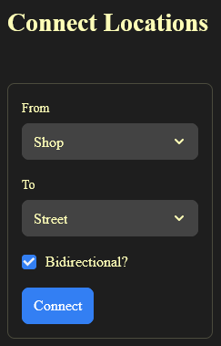
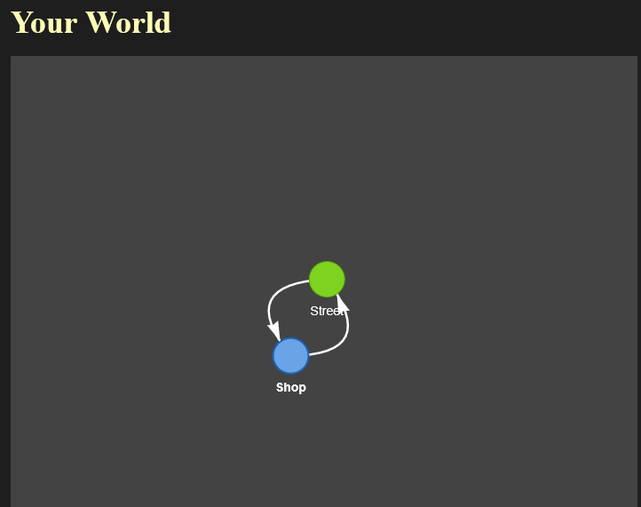
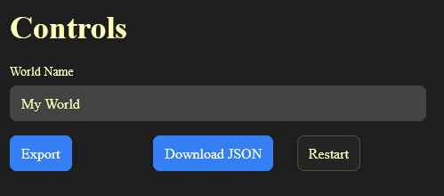

WorldNavigator Editor
=====================

The WorldNavigator Editor is a web application that allows you to create and edit virtual worlds using a graph-like interface.
You can access it here: `WorldNavigator Editor`_.

.. _WorldNavigator Editor: https://worldnavigator-editor.streamlit.app/

.. danger:: 

  Currently, there is no option to delete a location once created. The only workaround is to reload the page. This issue will be fixed in a future update.

Interface Sections 
------------------

When you open the editor, you'll find four main sections: :ref:`Add Location`, :ref:`Connect Locations`, :ref:`Your World`, and :ref:`Edit Location` (at the bottom of the page).

.. _Add Location:

Add Location
------------

This section allows you to add new locations to your world. You need to provide:

* A unique name for the location
* Specify whether it's an indoor location (i.e., a building)
* Provide at least a day background image name (afternoon and night backgrounds are optional)

After adding a location, a new node will appear in the :ref:`Your World` section.

.. container:: images-side-by-side

  .. image:: ../../images/add_loc_blank.png
    :alt: Blank Location Form
    :width: 80%

  .. image:: ../../images/add_loc_data.png
    :alt: Location Form With Data
    :width: 80%

.. _Connect Locations:

Connect Locations
-----------------

This section allows you to establish connections between locations. You'll need to select:

* The source location ("from")
* The destination location ("to")
* Whether the connection is bidirectional

When bidirectional is selected, the connection works both ways (e.g., connecting ``A`` to ``B`` also allows travel from ``B`` to ``A``). All connections will be visually represented in the :ref:`Your World` section.

.. warning::
  If you deselect the ``bidirectional`` checkbox, you're creating a one-way path. This means characters can travel from the source to the destination, but not back (e.g., from ``A`` to ``B``, but not from ``B`` to ``A``).

.. _Your World:

Your World
----------

This section displays a visual representation of your world. You can see:

* All locations as nodes
* Connections between locations
* Location types (indoor locations appear as blue nodes, outdoor locations as green nodes)

You can rearrange nodes by dragging them, though this doesn't affect the world's functionality.

.. _Edit Location:

Edit Location
-------------

If you need to modify a location, this section allows you to:

* Change the location name
* Update background images
* Toggle the indoor/outdoor status

After saving your changes, the updates will be reflected in the :ref:`Your World` section.

.. warning:: 
  Currently, you cannot modify connections between nodes. This feature will be added in a future update. Please be careful when establishing connections between locations.

.. container:: images-side-by-side

  .. image:: ../../images/edit_loc.png
    :alt: Edit Location Interface
    :width: 500px

  .. image:: ../../images/edited_world_view.png
    :alt: Updated World View
    :width: 200px

.. _Export World:

Export World
------------

To export your world:

1. Provide a name for your world
2. Click the export button
3. Download the generated JSON file

This JSON file contains all the information about your world and can be imported into your game to be used with the :class:`WorldParser <worldnavigator.core.WorldParser>` class.

